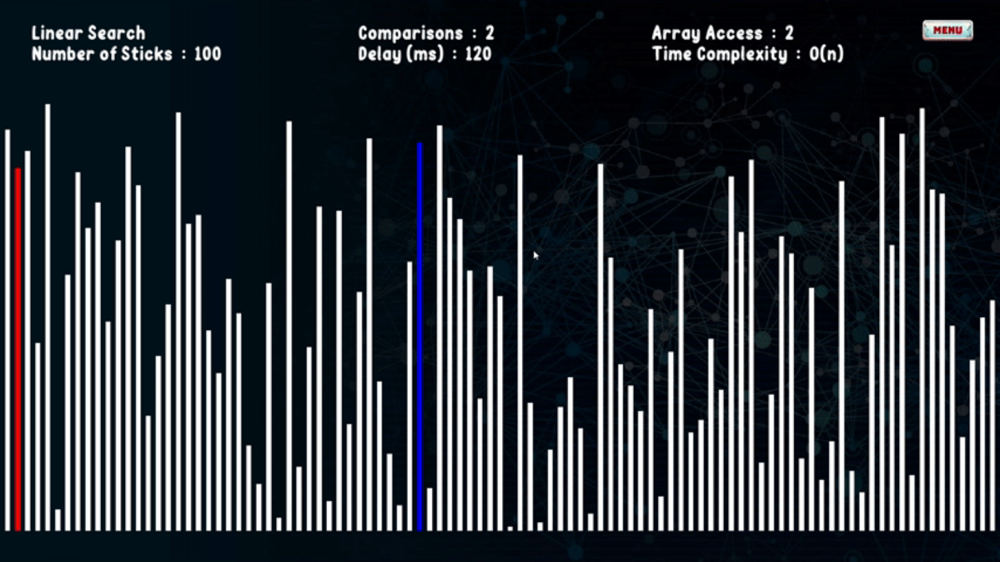
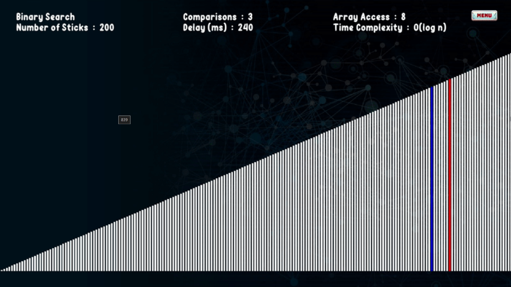

# 🔍 Searching-Stick

**Searching-Stick** is a desktop visualization project built in **C++** using **SFML** that demonstrates the mechanics of **Linear Search** and **Binary Search** in a visually expressive, multithreaded environment. This project is part of my personal portfolio, designed to reflect my understanding of systems design, real-time rendering, and event-driven programming.

---

## 🎯 Project Description

This application presents both linear and binary search processes visually in parallel, using dynamic animations and sound feedback to reflect the search state in real time. The focus of this project is not on teaching the algorithms themselves, but rather on showcasing how algorithmic processes can be represented visually and interactively using low-level graphics handling and modular code architecture.

The visualization operates on a simulated array represented by vertical bars (or "sticks") of varying heights. As the search proceeds, different states—such as comparisons, selections, and results—are highlighted through color transitions and sound cues. Each search runs in a separate thread, ensuring responsiveness and preventing UI blockage during computation.

---

## 🧩 Architecture and System Design

The codebase is structured into independent services, each with a clearly defined responsibility. Rather than relying on tight interdependencies, the project leverages a **Service Locator** pattern for decoupling and flexibility.

- `GameplayService` manages the core logic for search algorithms.
- `UIService` handles all rendering responsibilities via SFML.
- `SoundService` generates contextual audio feedback for visual events.
- `EventService` processes user inputs and window system events.
- `ServiceLocator` provides unified access to all services, promoting loose coupling and simplifying access across modules.

While not following strict MVC, the architecture adheres to separation of concerns and is designed for clarity and extensibility. Each service is isolated within its own namespace and maintains internal logic independent of others.

Multithreading is used deliberately to animate the algorithm's step-by-step behavior, allowing viewers to witness and analyze each stage of the search visually and interactively.

---

## 🧠 Design Goals

The primary intention behind Searching-Stick was to create an experimental visual platform to explore how fundamental search algorithms behave in motion and how their logic can be interpreted through sound and color.

Rather than relying on prebuilt frameworks or high-level engines, the project is built entirely with C++ and SFML. This gives precise control over memory, rendering, and performance, reflecting a hands-on approach to systems programming and custom architecture.

The project serves as a showcase of:

- Low-level graphics and UI rendering.
- Real-time system behavior with multithreading.
- Service-oriented architecture with modular separation.
- Integration of sound and visual feedback mechanisms.

---

## 🔧 Build Instructions

To compile and run the project, ensure the following:

### Requirements:
- C++17 or later
- SFML 2.5 or newer

### Steps:
1. Clone the repository.
2. Configure your build system (such as CMake or your IDE) to include SFML headers and link SFML libraries.
3. Build the project and execute the binary.

There are no external dependencies beyond SFML.

---

## 🖼️ Screenshots

Add screenshots here to demonstrate the application’s runtime appearance and interface.

| Linear & Binary Search Visualization |
|--------------------------------------|
|  |
|  |

---

## 📌 Final Note

This project is a personal technical showcase rather than an educational tool. It reflects a commitment to thoughtful design, clean code architecture, and system-level control in C++. The codebase is extendable and well-structured for further enhancement, and stands as an example of how core concepts in computer science can be brought to life visually and interactively.

---

